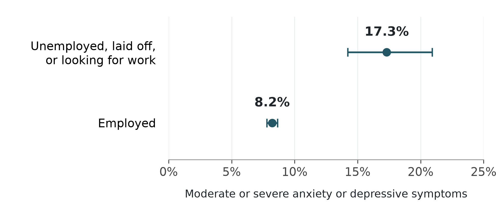

Job seeking as a psychiatric exposure

A public health position from the hiring industry

Jacob E. Thomas, PhD

Results Generation, Austin, Texas, United States

Correspondence: jacob.thomas@resultsgeneration.com

Article type: Position paper with an empirical illustration

Abstract

The health consequences of unemployment are well established, but unemployment status does not describe what people encounter while trying to obtain work. We argue that the organization of job seeking should be treated as a potential psychiatric exposure: a set of conditions that may contribute to anxiety and depressive symptoms through financial insecurity, repeated social evaluation, uncertainty, and loss of control. This perspective places responsibility on employers and hiring platforms as well as on public policy. To establish the public health relevance of the population, we analyzed public National Health Interview Survey data from 2022 and 2025. Among 26,281 adults aged 18–64, moderate or severe anxiety or depressive symptoms were present in 17.3% of those classified as unemployed, laid off, or looking for work and 8.2% of those classified as employed. The adjusted prevalence ratio was 1.92 (95% confidence interval, 1.58–2.33). These cross-sectional data establish a burden; they cannot identify harm caused by job seeking or any hiring practice. We propose measuring the conditions of search directly, testing changes to vacancy information, communication, assessment demands, and access to review, and evaluating mental health alongside hiring outcomes. Industry participation should make hiring practices observable and open to independent evaluation. It should not give employers access to applicants’ mental health records. A public health approach asks whether systems can reduce avoidable harm while people seek a livelihood.

Keywords: job seeking; unemployment; mental health; hiring; public health; structural exposure

The public health question

Looking for work is an encounter with institutions that control access to income, security, and social participation. An applicant can invest time, complete assessments, and attend interviews without knowing whether a vacancy is funded, when a decision will be made, or whether the application remains under consideration. Each event may appear minor to the organization that produces it. For the person seeking work, repeated uncertainty and evaluation can become a sustained condition of daily life. The question is whether the way hiring is organized contributes to psychiatric symptoms, beyond the consequences of having no job.

This question extends an established literature. A meta-analysis found poorer mental health among unemployed people and evidence of change following unemployment and reemployment, while also recognizing health selection into employment. [1] More directly, a daily diary study of unemployed job seekers in China found evidence that search activity and distress influenced one another; negative search experiences helped account for the association from searching to distress. [2] Neither finding establishes that every job search is harmful. Together they justify investigating the environment in which searching takes place.

We define a psychiatric exposure here as a condition or repeated experience that may alter the probability or severity of psychiatric symptoms. The term does not imply a new diagnosis, nor does it classify understandable disappointment as illness. The proposed exposure is the organization of access to work: the rules, information, demands, and decisions encountered during a search. Unemployment status, search activity, and hiring conditions are related but distinct. A person may search while employed, be unemployed without actively searching, or be unable to search because of illness or caregiving.

Our position is that avoidable psychiatric harm during job seeking is a public health concern and a responsibility of the hiring industry. “Structural” refers to conditions shared across applicants and shaped by organizational or policy choices, rather than to an applicant’s resilience alone. The social causes of illness often operate through access to resources and control over important circumstances. [3] Applying that perspective to hiring directs attention to who designs the process, who bears its costs, and who can change it.

We use “psychological recession” as a framing phrase for the burden people may experience while trying to secure work, including when aggregate economic indicators appear favorable. It is not a diagnostic category, an index with a validated cutoff, or a claim that mental health follows a particular business cycle. The contribution is a testable public health position: access to employment should be evaluated partly by its consequences for the people who must navigate it.

What the evidence does and does not establish

Several pathways make this position plausible. First, searching takes place within material constraints. In a longitudinal study after job loss, financial strain and diminished personal control were linked to depression and poorer functioning. [4] A four-wave study of job seekers in three countries likewise associated perceived unemployment insurance generosity with better mental health through lower time pressure and financial strain. [5] These studies support attention to resources and control. They do not show that better application design can compensate for inadequate income or a shortage of suitable jobs.

Second, selection exposes applicants to judgments about their competence and value. Research on applicant reactions links perceptions of selection procedures with attitudes toward organizations and aspects of self-perception. [6] This literature is relevant to the experience of hiring, but organizational satisfaction is not a psychiatric outcome. Studies of rejection also complicate simple remedies: specific performance feedback has sometimes reduced well-being among rejected applicants. [7] A prompt, accurate closure notice and an unsolicited personal evaluation are different interventions. Their effects should be tested separately.

Third, health can influence the search itself. Symptoms may affect effort, concentration, and persistence, and employers may discriminate against applicants with a history of mental health problems. In a Norwegian correspondence experiment, otherwise comparable applicants who disclosed such a history received fewer favorable responses. [8] This finding supports a possible feedback process between health and exclusion; it does not estimate the size of that process in the United States. It also warns against using applicants’ symptom scores to rank, route, or exclude them.

Finally, harm is not inevitable. A randomized job-search workshop study found improvements in reemployment and mental health at two years. [9] That evidence demonstrates that support during unemployment can matter. It does not validate particular job-board features, and it should not shift all responsibility onto applicants to cope better. The unresolved question is how much burden could be prevented by changing the conditions they encounter.

Our industry perspective is useful because employers, recruitment firms, and platforms can document and alter those conditions. It also creates a competing interest: organizations may prefer explanations that preserve their own practices. The appropriate response is explicit disclosure, public methods, independent evaluation, and publication of unfavorable results. Insider knowledge should generate specific questions, not substitute for evidence.

An empirical illustration using public data

Data and population

We used the 2022 and 2025 National Health Interview Survey (NHIS) Sample Adult public-use files, obtained from the National Center for Health Statistics (NCHS). NHIS samples the civilian noninstitutionalized United States population. Both years contain the same employment recodes and the eight-item Patient Health Questionnaire (PHQ-8) and seven-item Generalized Anxiety Disorder scale (GAD-7). [10, 11] These are two survey snapshots, not a panel following the same people. We selected them for compatible measures, not to represent every intervening year.

The analysis included adults aged 18–64. The comparison was between the NHIS category “Unemployed, laid off, looking for work” (EMPWHYNOT_A = 1) and the employed recode (EMPWRKLSW1_A = 1). The latter includes certain temporary absences, seasonal or contract work within the previous year, and unpaid work in a family business. Other reasons for not working were excluded. For readability, we refer to the first category as the unemployment/search group. It is broader than verified active job seeking and supplies no information about applications, rejection, or hiring platforms. Employed respondents may also be searching.

Outcomes and regression

The primary outcome was moderate or severe depressive or anxiety symptoms in the previous two weeks: a PHQ-8 or GAD-7 score of at least 10, using the NCHS severity recodes PHQCAT_A and GADCAT_A. [12, 13] Both recodes had to be observed. These measures describe symptom severity, not clinician-confirmed diagnoses. We also analyzed the two outcomes separately using the same sample.

We calculated survey-weighted prevalence and fitted modified Poisson regressions with a log link to estimate prevalence ratios. [14] In plain language, the adjusted ratio compares symptom prevalence between the two employment categories after accounting for specified demographic differences. The model was log(expected outcome) = intercept + employment category + year + age group + sex + race and Hispanic origin + education + region. A prevalence ratio is obtained by exponentiating the employment-category coefficient.

Age groups were 18–29, 30–44, 45–54, and 55–64. Race and Hispanic origin were grouped as Hispanic, non-Hispanic White, Black, Asian, and other non-Hispanic groups. Education was less than high school, high school or GED, some college or associate degree, and bachelor’s degree or higher. Sex used the two public-file categories, and region used the four Census regions. We did not adjust for current income or financial strain, which could be consequences of unemployment, while recognizing that earlier financial resources may confound the association.

Pooled weights were WTFA_A divided by two. We retained the released PSTRAT and PPSU identifiers, including all sampled design units with zero contributions outside the analysis population. Following the NCHS instructions, public-use strata were not relabeled for the 2025 redesign. [11] Confidence intervals used a Taylor-linearized, stratum-centered cluster sandwich variance; prevalence intervals used a logit transformation. We used a conventional t approximation with primary sampling units minus strata as degrees of freedom (1,133 pooled). NCHS cautions that this is a rule of thumb, not an exact NHIS degrees-of-freedom calculation. [11]

The exploratory analysis plan was written before fitting these models and was not preregistered. Sensitivity analyses required complete responses to all 15 symptom items, narrowed the employed comparator to work in the previous week or temporary absence, and excluded respondents reporting disability. We also bounded prevalence by assigning every missing symptom outcome first to absence and then to presence of symptoms. An employment-category-by-year interaction examined whether the association differed between the two snapshots. The public repository contains frozen source files, checksums, all coding decisions, model coefficients, and executable checks. [15]

Results

The original files contained 27,651 sample adults in 2022 and 24,215 in 2025. Among adults aged 18–64, 26,487 met the employment criteria. We excluded 85 with missing symptom outcomes and a further 121 with missing covariates. The final sample contained 26,281 adults: 14,080 in 2022 and 12,201 in 2025, including 796 in the unemployment/search group and 25,485 in the employed group. The corresponding unemployment/search counts were 407 and 389 by year.

Pooled symptom prevalence was 17.3% (95% confidence interval [CI], 14.2–20.9) in the unemployment/search group and 8.2% (95% CI, 7.8–8.6) in the employed group (Figure 1). The unadjusted prevalence ratio was 2.11 (95% CI, 1.73–2.57); the adjusted ratio was 1.92 (95% CI, 1.58–2.33). Thus, measured symptoms were nearly twice as prevalent after demographic adjustment. This is an association with a broad employment category, not the estimated causal effect of a job search.

Figure 1. Symptom burden by employment category

Points show pooled survey-weighted prevalence; whiskers show 95% confidence intervals. Adults aged 18–64 in the 2022 and 2025 NHIS, complete-case sample (n = 26,281). The unemployment/search category is not a verified measure of active searching. Symptoms are PHQ-8 or GAD-7 scores of at least 10, not clinical diagnoses.

Associations were present for depressive and anxiety symptoms separately and remained under the sensitivity restrictions (Table 1). Excluding adults with disability attenuated the estimate to 1.70 (95% CI, 1.34–2.16). That attenuation is consistent with the importance of health selection, but the restriction neither measures prior mental health nor resolves reverse causation. Across the full employment-eligible population, the extreme bounds for missing outcomes were 17.2%–17.5% in the unemployment/search group and 8.2%–8.6% in the employed group. These bounds address item nonresponse, not survey nonparticipation or missing confounders.

In 2022, prevalence was 15.7% in the unemployment/search group and 8.2% in the employed group; in 2025, it was 18.6% and 8.3%, respectively. The ratio of the year-specific adjusted prevalence ratios was 1.15 (95% CI, 0.79–1.68; interaction p = 0.462). The data did not provide clear evidence that the association changed. They cannot establish a worsening trajectory between the two years.

Table 1. Prevalence ratios and sensitivity analyses

| Analysis | Sample n | Prevalence ratio (95% CI) |

| --- | --- | --- |

| Primary outcome, unadjusted | 26,281 | 2.11 (1.73–2.57) |

| Primary outcome, adjusted | 26,281 | 1.92 (1.58–2.33) |

| Depressive symptoms, adjusted | 26,281 | 2.18 (1.75–2.71) |

| Anxiety symptoms, adjusted | 26,281 | 1.99 (1.58–2.52) |

| All symptom items complete, adjusted | 26,170 | 1.91 (1.57–2.32) |

| Narrower employed comparator, adjusted | 26,042 | 1.90 (1.56–2.31) |

| Adults without disability, adjusted | 25,313 | 1.70 (1.34–2.16) |

Each ratio compares the unemployment/search group with the employed group. Primary outcome: moderate or severe anxiety or depressive symptoms. Adjusted models include year, age group, sex, race and Hispanic origin, education, and Census region. The narrower comparator requires work last week or temporary absence from a job. Disability exclusion uses DISAB3_A = 2. Sample sizes are unweighted; all estimates account for survey weights, strata, and clustering.

Interpretation

This illustration establishes why the population merits attention. It does not establish the proposed mechanism. The excess prevalence could reflect the consequences of job loss, prior illness, financial disadvantage, selection into employment, hiring conditions, or combinations of these processes. Adjustment for observed demographics cannot separate them. The point of presenting the analysis is to connect a substantial, reproducible symptom burden to a sharper research and industry agenda, rather than to relabel an employment coefficient as structural harm.

What the hiring industry can change

The industry can make exposure visible before claiming to make it safer. A useful starting point is to record whether a posting represents a current vacancy, how long applicants wait at each stage, which demands are imposed, and when the process ends. These records describe organizational practices. They should be assessed alongside applicant reports of uncertainty, financial strain, and symptoms, without treating those reports as interchangeable measures.

Table 2 sets out four priorities. Each specifies a modifiable practice and an observable measure. The recommendations are proposals for evaluation, not established psychiatric treatments. A reduction in processing time, for example, would not automatically mean better mental health if it came with rushed decisions, inaccessible assessments, or more frequent rejection. Operational improvements and health outcomes both need measurement.

Table 2. Hiring practices that can be measured and changed

| Priority | Observable measure | Proposed change to evaluate |

| --- | --- | --- |

| Vacancy accuracy | Whether an advertised vacancy is current, authorized, and accepting applications; time to remove closed listings. | Label vacancy status, distinguish ongoing talent pools, and close unavailable roles promptly. |

| Predictable communication | Days without an update; whether stages and decision dates are stated; whether applicants receive closure. | Publish the process and update schedule; provide accurate status and a defined closure procedure. |

| Proportionate demands | Applicant time and out-of-pocket costs; repeated forms; length and number of unpaid assessments. | Remove duplicate demands, limit unpaid tasks, and test compensation for substantial assessments. |

| Accessible review | Availability and use of accommodations, explanations of process, and review of disputed exclusions. | Offer accessible routes to request assistance or review; audit differences in access and outcomes. |

These are proposed intervention targets, not demonstrated causes of psychiatric disorder or proven treatments. Evaluate mental health, employment quality, access, and unintended effects together. Process transparency does not require sharing confidential evaluations or collecting clinical information for hiring decisions.

Responsibility is shared but should be assigned explicitly. Employers control vacancy authorization, selection demands, and final decisions. Platforms control how opportunities and status information are presented and what conduct they require from participating employers. Recruitment intermediaries can document where delays arise and communicate realistic expectations. Agreements among these actors should specify who updates applicants and who closes a vacancy. A process with several owners should not leave the applicant without an answer.

Economic conditions also matter. Communication standards cannot create sufficient good jobs, replace income support, or remove discrimination throughout the labor market. Evidence connecting financial strain and time pressure to mental health makes those limits central to the position. [4, 5] The practical aim is to reduce avoidable burdens within hiring while keeping broader employment and social protection policy in view.

Industry evaluation should include unsuccessful applicants, people who withdraw, and those who stop using a platform. Studying only completed hires would overlook many people most exposed to uncertainty and rejection. Results should report who was reached, who declined research participation, and who was lost to follow-up. Applicants should be able to participate or decline without affecting selection, with health information held by an independent research team and separated from hiring records available to decision-makers.

A testable research agenda

The next study should measure the exposure directly. Recruit people near the start of a search, including employed searchers, and measure baseline mental health, recent job loss, prior health history, financial resources, caregiving responsibilities, and occupational circumstances. Follow participants at fixed intervals through search, withdrawal, and reemployment. Link consented process records to repeated reports of uncertainty and control, and assess symptoms using the same validated scales at each wave. Logging application volume alone is insufficient: applying repeatedly may be a response to distress or a poor labor market, as well as a source of strain. [2]

A regression framework can make the question transparent. The primary observational model would relate later symptom severity to a previously measured hiring exposure, adjusting for baseline symptoms and prespecified confounders. Repeated observations would require allowance for clustering within people and shared employers or platforms. Calendar time and local labor-market conditions should be measured where possible. A temporal sequence improves interpretation but does not itself eliminate unmeasured confounding, selection, or changes in exposure caused by earlier symptoms.

A stronger test would randomize an organizational practice, such as scheduled status updates and a defined closure procedure, across employers or hiring units. Applicants would receive the practice assigned to the unit, and the primary analysis would compare later symptoms by assignment, adjusting for baseline symptoms and the randomization design. Follow-up should continue after withdrawal or employment. Conditioning the main analysis on eventual hiring would select on an outcome the intervention may itself change. The primary endpoint, follow-up interval, clinically relevant difference, sample size, and approach to attrition should be specified before recruitment.

For mechanism testing, a longitudinal structural equation model could examine whether an earlier exposure predicts later uncertainty or loss of control, which in turn predicts subsequent symptoms. Exposure records, mediators, and outcomes should remain distinct. Such a model requires adequate repeated measurements, a justified measurement model, and explicit assumptions about confounding of each pathway. Model fit alone would not establish causation. The current NHIS illustration contains neither the exposures nor the temporal sequence needed for that analysis, so no mediation or structural equation model is fitted here.

The most consequential research question is comparative: which changes reduce symptoms without reducing access to suitable work or transferring burdens to disadvantaged applicants? Trials should measure employment quality and access alongside health, examine variation across relevant social groups, and publish null or adverse findings. A feature that improves employer satisfaction while increasing applicant distress would not meet this public health standard.

Limitations of the position and illustration

The empirical illustration has several limits. Its broad unemployment/search category does not identify active searching, search duration, the number of applications, or exposure to specific hiring practices. The employed comparator includes some job seekers and heterogeneous work arrangements. The surveys are cross-sectional, so the direction of the association is unresolved. Prior mental health, wealth, job quality, and local opportunity are incompletely captured by the adjustment set. Self-reported symptoms are screening measures, and exclusion of institutionalized populations limits coverage.

Small numbers in the unemployment/search group produce wider intervals than in the employed group. Complete-case analysis assumes that the remaining exclusions do not materially distort comparisons; the missing-outcome bounds do not address all selection processes. Survey weights reduce some coverage and nonresponse differences but cannot guarantee their removal. The 2025 NHIS introduced a new sample design and experienced a federal-funding-related interruption in data collection; its final weighted Sample Adult response rate was 41.3%. [11] These features reinforce caution about time comparisons. Pooled results describe the two included survey years, not an average of every year from 2022 through 2025.

The position also extends beyond the directly observed evidence. Findings from earlier studies and other countries make specific mechanisms plausible, but do not establish their present prevalence in United States hiring. The literature discussed is a focused selection supporting a position, not a systematic review. No estimate is offered of the number of illnesses caused by hiring systems, the share preventable by platform changes, or an economic return on intervention. Those are empirical questions for the proposed studies.

Conclusion

People seeking work should not have to bear avoidable uncertainty, demands, and exclusion simply because these costs are difficult for hiring organizations to see. Public data show a substantial symptom burden among adults classified as unemployed, laid off, or looking for work. Existing research gives reason to investigate the search environment itself. The next step is to measure that environment and test changes to it. Employers, platforms, and public health researchers can make access to work an object of prevention as well as an employment outcome.

Declarations

Competing interests: Jacob E. Thomas works in recruitment marketing at Results Generation. This industry affiliation is relevant to the position advanced here. No proprietary applicant records, platform analytics, or employer data were used in the empirical illustration.

Funding: No external funding.

Ethics: The empirical illustration is a secondary analysis of deidentified, publicly released NHIS files. It involved no participant recruitment or access to restricted records.

Data and code: Official source files, SHA-256 checksums, the analysis plan, code, generated results, reference audit, and manuscript source are available in the PsychologicalRecession repository. [15] The archived exploratory index is not used in this analysis. All essential methods, results, tables, and references are included in this paper.

References

1. Paul KI, Moser K. Unemployment impairs mental health: Meta-analyses. Journal of Vocational Behavior. 2009;74(3):264–282. https://doi.org/10.1016/j.jvb.2009.01.001

2. Song Z, Uy MA, Zhang S, Shi K. Daily job search and psychological distress: Evidence from China. Human Relations. 2009;62(8):1171–1197. https://doi.org/10.1177/0018726709334883

3. Phelan JC, Link BG, Tehranifar P. Social conditions as fundamental causes of health inequalities: Theory, evidence, and policy implications. Journal of Health and Social Behavior. 2010;51(suppl):S28–S40. https://doi.org/10.1177/0022146510383498

4. Price RH, Choi JN, Vinokur AD. Links in the chain of adversity following job loss: How financial strain and loss of personal control lead to depression, impaired functioning, and poor health. Journal of Occupational Health Psychology. 2002;7(4):302–312. https://doi.org/10.1037/1076-8998.7.4.302

5. Wanberg CR, van Hooft EAJ, Dossinger K, van Vianen AEM, Klehe UC. How strong is my safety net? Perceived unemployment insurance generosity and implications for job search, mental health, and reemployment. Journal of Applied Psychology. 2020;105(3):209–229. https://doi.org/10.1037/apl0000435

6. Hausknecht JP, Day DV, Thomas SC. Applicant reactions to selection procedures: An updated model and meta-analysis. Personnel Psychology. 2004;57(3):639–683. https://doi.org/10.1111/j.1744-6570.2004.00003.x

7. Schinkel S, van Dierendonck D, van Vianen A, Ryan AM. Applicant reactions to rejection: Feedback, fairness, and attributional style effects. Journal of Personnel Psychology. 2011;10(4):146–156. https://doi.org/10.1027/1866-5888/a000047

8. Bjørnshagen V. The mark of mental health problems. A field experiment on hiring discrimination before and during COVID-19. Social Science & Medicine. 2021;283:114181. https://doi.org/10.1016/j.socscimed.2021.114181

9. Vinokur AD, Schul Y, Vuori J, Price RH. Two years after a job loss: Long-term impact of the JOBS program on reemployment and mental health. Journal of Occupational Health Psychology. 2000;5(1):32–47. https://doi.org/10.1037/1076-8998.5.1.32

10. National Center for Health Statistics. 2022 National Health Interview Survey questionnaires, datasets, and documentation. Sample Adult public-use data, codebook, and survey description. Accessed September 29, 2026. https://www.cdc.gov/nchs/nhis/documentation/2022-nhis.html

11. National Center for Health Statistics. 2025 National Health Interview Survey questionnaires, datasets, and documentation. Sample Adult public-use data, codebook, and survey description. Accessed September 29, 2026. https://www.cdc.gov/nchs/nhis/documentation/2025-nhis.html

12. Kroenke K, Strine TW, Spitzer RL, Williams JBW, Berry JT, Mokdad AH. The PHQ-8 as a measure of current depression in the general population. Journal of Affective Disorders. 2009;114(1–3):163–173. https://doi.org/10.1016/j.jad.2008.06.026

13. Spitzer RL, Kroenke K, Williams JBW, Löwe B. A brief measure for assessing generalized anxiety disorder: The GAD-7. Archives of Internal Medicine. 2006;166(10):1092–1097. https://doi.org/10.1001/archinte.166.10.1092

14. Zou G. A modified Poisson regression approach to prospective studies with binary data. American Journal of Epidemiology. 2004;159(7):702–706. https://doi.org/10.1093/aje/kwh090

15. Thomas JE. PsychologicalRecession. Public data, analysis code, manuscript, and audit records. GitHub repository. Revision dated September 29, 2026. https://github.com/jethomasphd/PsychologicalRecession
