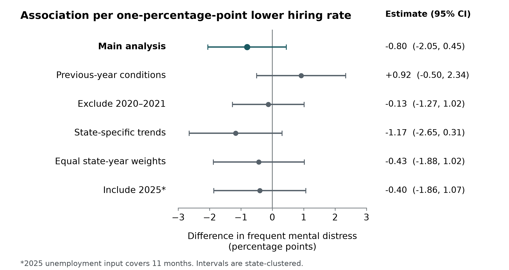

Job seeking as a psychiatric exposure

Labor-market conditions, mental distress, and the responsibilities of the hiring industry

Jacob E. Thomas, PhD

Results Generation, Austin, Texas, United States

Correspondence: jacob.thomas@resultsgeneration.com

Article type: Empirical editorial / position paper

Abstract

The conditions under which people seek work deserve attention as potential psychiatric exposures. A low unemployment rate can coexist with limited hiring, prolonged searches, and uncertainty about whether advertised opportunities will lead to employment. We bring together research on labor-market shocks, job-search experiences, industry surveys, preprints, and reporting, and estimate associations between mental-health burden and market conditions. We linked Behavioral Risk Factor Surveillance System records to state hiring, vacancy, and unemployment measures. The primary analysis included 193,060 adults aged 18–64 who reported being out of work in 607 state-years, 2013–2024. Survey-weighted regressions compared changes within states, accounting for national year effects and demographic composition. A one-percentage-point lower hiring rate was associated with -0.80 percentage points in frequent mental distress (95% confidence interval, -2.05 to 0.45), conditional on unemployment. Doubling unemployed people per opening was associated with 1.71 percentage points more distress (-0.01 to 3.44) in a separate model. Hiring estimates changed direction with lagged exposure; neither main interval excluded zero. These results do not establish that slow hiring causes illness. They show why unemployment status, access to opportunities, and the experience of searching must be measured separately. Employers and platforms should make recruitment conditions observable, enable independent evaluation, and test whether reducing avoidable uncertainty improves mental health. Industry testimony and surveys help identify exposures; representative health data and stronger research designs are needed to estimate their consequences.

Keywords: job seeking; labor market; mental distress; hiring; structural exposure; public health

The health question is about access to work

For a person trying to obtain a job, the relevant labor market is the one they can enter. An unemployment rate describes how many people are without work and seeking it under a particular statistical definition. It does not describe how often employers hire, how many plausible opportunities an applicant encounters, or how long a search remains unresolved. Associated Press reporting in late 2025 illustrated this distinction through job seekers facing canceled recruitment and long searches during a period of low unemployment and slow hiring. [1] These experiences raise a public health question: when access to work becomes prolonged, uncertain, and difficult to influence, does the environment contribute to mental illness?

We argue that job seeking should be studied as an encounter with a potentially harmful environment. The exposure includes the availability of suitable work, competition for that work, the demands of applying, and the information employers provide. Its effects may operate through financial insecurity, repeated rejection, diminished control, and uncertainty about the future. This definition includes people searching while employed. It also distinguishes active searching from simply being out of work.

“Psychiatric exposure” names a research question about conditions that may contribute to symptoms or disorders. It is not a diagnosis or a claim that disappointment is itself illness. The term “psychological recession” is useful only if it directs attention to measurable burdens that conventional economic summaries miss.

Our industry perspective matters because recruitment systems are designed and maintained by identifiable organizations. Those organizations determine whether applications receive a response, whether assessments require substantial unpaid time, and whether a posting accurately describes a current opportunity. Responsibility for these conditions cannot rest entirely on applicants’ coping skills. At the same time, industry familiarity is not evidence of causation. We therefore combine a focused review of different kinds of evidence with a reproducible analysis relating mental-health burden to actual labor-market measures.

What the existing evidence tells us

Labor demand can matter beyond employment status

The association between unemployment and poor mental health is well established, including evidence of change following unemployment and reemployment. Health also affects entry to and exit from employment. [2] The more specific question is whether the opportunities available in a labor market alter this burden. Charles and DeCicca studied working-age men in 58 large US metropolitan areas and found that worsening conditions were associated with poorer mental health in groups with weaker employment prospects, including less-educated and Black men. [3]

A study of Spain’s construction collapse provides a more direct link between demand for labor and health. Farré and colleagues used pre-crisis industry composition and the subsequent contraction to estimate the consequences of job losses in exposed labor markets. Their findings linked the shock to worse mental health in a setting where reemployment was difficult. [4] The design depends on assumptions about the instrument and the pathways from the construction shock to health. It nevertheless addresses a structural change in opportunity, rather than attributing all differences between employed and unemployed people to joblessness itself.

The expected relationship is not uniformly negative. Clark’s panel study found that unemployed people reported better well-being when unemployment was more common in their reference groups, particularly among men. [5] Reduced stigma may coexist with worse employment prospects. In US BRFSS data, Gagné and colleagues found that the associations of short- and long-duration out-of-work status with distress among young adults varied over time. [6] A credible account must allow for these differences instead of assuming one psychological response to every downturn.

Search experiences offer plausible pathways

A daily diary study of unemployed people in China linked job searching and psychological distress in both directions; negative search experiences helped explain the association from searching to distress. [7] Longitudinal research after job loss also linked financial strain and diminished personal control to depression and impaired functioning. [8] In a study across three countries, perceived unemployment-insurance generosity was associated with mental health through financial strain and time pressure. [9] Together, these findings make the conditions of searching relevant to prevention. They do not show that an improved application process can compensate for a shortage of suitable jobs or inadequate income.

There is also a possible feedback loop. A Norwegian correspondence experiment found fewer positive employer responses when applications disclosed a history of mental health problems. [10] Poor mental health can therefore be both an outcome of difficult access to work and a source of further exclusion. The mechanism is not captured by counting vacancies alone. A 2026 Upjohn working paper, using Survey of Household Economics and Decisionmaking data, relates labor-market tightness to job changes and job quality. [11] It offers evidence about opportunity and the quality of work obtained, not a psychiatric effect estimate.

Industry surveys and reporting identify experiences worth measuring

Grey literature is essential for identifying features of contemporary recruitment that health surveys seldom ask about. It must also be read at the level of its actual questions and denominators. Resume Genius surveyed 1,000 active US job seekers in August 2024, with 500 employed and 500 unemployed respondents. Seventy-two percent reported that searching had negatively affected their mental health at some point in their lives. [12] The outcome is a lifetime, self-attributed experience in an online sample; it is not the prevalence of current depression or anxiety. Forbes subsequently reported the same survey. [13] The two publications represent one source of participants, not independent confirmation.

Greenhouse’s 2024 report summary described a survey of 2,500 workers across the United States, United Kingdom, and Germany and reported heightened anxiety among US respondents, alongside post-interview nonresponse. [14] The multinational sample total should not be used as the denominator for the US anxiety statistic. The public summary also does not establish whether nonresponse or a suspected “ghost job” caused clinical symptoms. Huntr’s reports provide application and search-process information from platform users, but user selection, incomplete searches, and self-reported events limit population claims. The Q1 2026 report itself cautions that applicants’ perceptions of AI rejection do not verify employers’ use of automatic rejection. [15]

A Federal Reserve qualitative study adds a different form of evidence: 63 participants in 11 focus groups held in late 2025 described financial pressure, unstable work, and barriers to obtaining better employment. [16] Such accounts help identify mechanisms and the language people use to describe their experience. They cannot supply a population prevalence or isolate the contribution of hiring from housing costs, caregiving, and other pressures.

Preprints warrant the same scrutiny. Ng’s ghost-jobs preprint classified Glassdoor interview reviews using text models. The often-quoted 21% refers to classifier-positive reviews in a selected sample, not a probability sample of all advertised vacancies. Employer intent was not independently verified, and psychiatric outcomes were not measured. [17] It is useful as exploratory measurement work. Those data cannot establish the population prevalence of nonexistent vacancies.

Linking public mental-health data to market conditions

Sources and population

We linked public annual records from the Behavioral Risk Factor Surveillance System (BRFSS) to state labor-market data from the Bureau of Labor Statistics (BLS). BRFSS provides the respondent’s state, survey year, employment category, demographic characteristics, survey weight, and number of days in the past month when mental health was not good. We used 2013 onward to maintain the EMPLOY1 employment-status series, after the major 2011 survey-weighting and cellphone changes. [18] The primary population was adults aged 18–64 reporting that they were out of work for less than one year or for at least one year. These categories do not verify active search, willingness to accept work, or exposure to a particular job board. Employed and self-employed adults were analyzed separately for context.

The primary period was 2013–2024. The available files omitted New Jersey in 2019, Florida in 2021, Kentucky and Pennsylvania in 2023, and Tennessee in 2024. No missing state-year was imputed. We excluded respondents missing the outcome, age, sex, education, race/ethnicity, or a positive survey weight. The final out-of-work analysis included 193,060 respondents in 607 state-years across all 50 states and the District of Columbia. The corresponding employed analysis included 2,223,024 respondents. The technical note reports the sample flow.

Frequent mental distress was defined as 14 or more mentally unhealthy days in the previous 30 days, following CDC’s surveillance definition. [19] We also analyzed the reported number of days, from zero to 30. Neither measure is a clinician-confirmed disorder. The BRFSS question includes stress, depression, and problems with emotions; it does not identify their source.

The primary market exposure was the mean of the 12 monthly state hires rates from the Job Openings and Labor Turnover Survey (JOLTS), measured as hires per 100 payroll employees. We used the seasonally adjusted series and expressed results for a one-percentage-point lower rate. This measures employment entry activity, including job-to-job movement; it is not an unemployed person’s probability of finding a job. State JOLTS estimates combine survey information with modeled administrative inputs. [20] We adjusted the primary model for the published annual-average unemployment rate from Local Area Unemployment Statistics (LAUS). [21] Separate models used the mean monthly unemployed-persons-per-opening ratio, expressed per doubling, and the mean job-opening rate, expressed per one-percentage-point decrease. The ratio captures relative scarcity; neither measure identifies whether openings match a particular applicant’s occupation or location.

We downloaded 2025 BRFSS and market data as well. However, October 2025 unemployment data were not collected during the federal shutdown. BLS’s 2025 unemployment averages cover 11 months and are not strictly comparable with earlier annual averages. [22] We therefore kept 2025 out of the complete-year primary analysis and evaluated a separately labeled extension through 2025. We did not fill the missing October competition ratio or treat an 11-month ratio as a complete annual measure.

Regression approach

The primary survey-weighted linear probability regression estimated absolute differences in distress. State fixed effects accounted for persistent differences between states; year fixed effects accounted for changes shared nationally. Additional terms included age group, sex as released in each survey, four education categories, and five race/ethnicity categories. In plain language, the model asks whether distress changed when a state’s hiring conditions changed relative to the national pattern, among respondents with the same measured demographic characteristics. It does not attribute the national rise in distress to the national hiring trend.

The primary hiring coefficient was estimated conditional on unemployment. That is a narrower association than the total health effect of a labor-demand shock, because unemployment may itself be part of that effect. We therefore also estimated hiring without unemployment adjustment. Income and unemployment duration were not adjustment variables in the primary model because they may lie on relevant pathways or reflect health selection. Analyses of the two out-of-work duration groups were reported separately.

We clustered uncertainty by state to allow observations within a state to be related across respondents and years, using a small-sample correction and a t distribution with 50 degrees of freedom for the 51-state models. This is a state-clustered analysis using survey weights, not a full BRFSS sampling-design variance calculation. It does not propagate uncertainty in BLS’s modeled state estimates. The analysis plan was recorded before fitting these linked models; it was not externally preregistered. All specified checks are reported. The technical note provides the equation and additional implementation detail.

What the linked analysis found

Among complete-case respondents in the participating states, weighted frequent mental distress was 21.2% in the out-of-work group in 2013 and 28.5% in 2024. The corresponding employed estimates were 8.6% and 14.9%. These are descriptive annual estimates with changing state coverage and respondent composition; they are not a causal comparison between employment groups or an explanation of the time trend.

The primary hiring estimate was -0.80 percentage points in distress for a one-percentage-point lower hiring rate (95% confidence interval, -2.05 to 0.45). The unemployment coefficient in the same model was 0.46 percentage points per one-percentage-point higher unemployment (-0.12 to 1.05). Neither interval excluded zero. The estimate for doubling unemployed people per opening was positive, 1.71 percentage points (-0.01 to 3.44), but remained imprecise. The job-opening-rate estimate was also uncertain. Table 1 reports all three exposure definitions with their confidence intervals.

Table 1. Labor-market conditions and frequent mental distress

| Change in market condition | Distress difference, pp | 95% confidence interval |

| --- | --- | --- |

| 1-point lower hiring rate (primary) | -0.80 | -2.05 to 0.45 |

| 1-point higher unemployment rate (same model) | 0.46 | -0.12 to 1.05 |

| Doubling unemployed people per opening (separate model) | 1.71 | -0.01 to 3.44 |

| 1-point lower job-opening rate (separate model) | 0.13 | -0.76 to 1.02 |

Out-of-work adults aged 18–64, 2013–2024; n = 193,060 in 607 state-years. pp = percentage points. All models include state, year, and demographic terms. Hiring and unemployment appear jointly in the primary model; other exposures are fitted separately. Exposure changes have different units, so coefficient magnitudes should not be ranked as equivalent effects. Confidence intervals are clustered by state.

The hiring results were not consistent with a simple claim that lower hiring produces more distress. Using the previous year’s conditions changed the direction of the hiring estimate to 0.92 percentage points (-0.50 to 2.34). Excluding 2020–2021, adding state-specific trends, using equal state-year weights, restricting to continuously observed states, and extending through 2025 did not produce a clear positive hiring association. Figure 1 and the technical note show these checks. The recent-out-of-work subgroup had an inverse estimate, while the longer-duration subgroup had an uncertain positive estimate. These exploratory differences do not establish that slower hiring protects health or that duration modifies a causal effect.

The separate employed analysis gave a hiring estimate near zero. A post hoc logistic-model check, prompted by a small number of out-of-range linear-model predictions, also gave an uncertain hiring association: -0.65 percentage points (-1.88 to 0.59). Independent calculations from the uncollapsed out-of-work records reproduced the main regression coefficients and state-clustered covariance.

Figure 1. Hiring estimates across model specifications

Each point is an adjusted association with frequent mental distress per one-percentage-point lower state hiring rate. Lines show 95% confidence intervals. Positive values indicate more distress; negative values indicate less. The previous-year model uses lagged hiring and unemployment. The 2025 extension uses the published 11-month unemployment input and has different state coverage. These observational estimates are not effects of an intervention.

How to interpret a mixed result

The analysis directly relates a measured health burden to measured market conditions. It does not provide strong evidence for a general same-year relationship between slower state hiring and greater distress among people currently out of work. The competition estimate is compatible with a meaningful increase as well as almost no difference. It should motivate replication, not a claim that a threshold has been crossed.

There are substantive reasons the exposures need not behave alike. Hiring counts include workers moving between jobs, people returning to the labor force, and seasonal turnover. Openings describe a stock of opportunities, while the unemployed-to-openings ratio also reflects the number of people competing for work. Applicant experiences depend on suitable vacancies, eligibility, pay, distance, and the way recruitment proceeds. A single statewide rate cannot represent all of these conditions.

Selection is especially important. A contraction can bring previously employed people into the out-of-work group and change its average health, even if some individuals become worse off. Conversely, people with better health may leave that group more quickly when opportunities improve. Conditioning on current employment status can therefore obscure or reverse an association that would appear in longitudinal follow-up. Annual surveys cannot distinguish those processes here. The inverse subgroup estimate reinforces the need for longitudinal follow-up.

Other limitations remain. State residence may poorly describe a remote or cross-border search. Survey nonresponse, missing covariates, changes in who reports symptoms, state policies, industry composition, and living costs may confound associations. State and year effects do not remove changing state-specific confounding. Annual exposure averages overlap the outcome’s recall period and sometimes include months after an interview; they establish no clear temporal order. Some interviews occur after the nominal survey year. Lagging exposure improves ordering only partially because prior residence and search histories are unknown. BLS modeling and rounding add measurement uncertainty. These limitations constrain both positive and null findings.

The literature review is focused and narrative, not a systematic review or a meta-analysis. We searched academic and institutional sources alongside industry reports, preprints, and popular reporting, tracing quantitative claims back to their original source. The repository records source type, review depth, claim support, and limitations. Abstract-only review is identified. Industry questionnaires and selected platform samples describe experiences that representative surveys omit, but their percentages are not interchangeable with clinical screening or BRFSS distress measures.

What an industry response should make possible

The strongest implication is a measurement and accountability agenda tied to testable interventions. Recruitment systems should record whether a position is funded and actively being filled, when an application changes status, when communication ends, and how much time an applicant is asked to invest. These records would make it possible to distinguish scarce opportunities from inaccurate information, prolonged silence, and burdensome procedures. Public reporting should use clear denominators, follow incomplete searches, and describe which applicants are missing from the data.

The next study should recruit people when they begin a search, including employed searchers, measure symptoms before substantial exposure, and follow them through offers, withdrawals, reemployment, or continued searching. With consent, weekly or monthly symptom assessments could be linked to the relevant geographic and occupational market, application events, financial strain, and perceived control. Validated symptom measures should sit alongside the practical outcomes applicants value: income, job quality, time spent searching, and the ability to leave harmful work. This design would separate baseline health from changes during a search and distinguish market conditions from platform experiences.

A regression framework can relate repeated symptom scores to prior market conditions and recruitment events, with person and time effects and prespecified adjustment for changing circumstances. A structural equation model would be useful only if financial strain, control, and symptoms were measured in an ordered sequence and its causal assumptions were defensible.

Employers and platforms can also randomize feasible changes: accurate vacancy-status notices, predictable communication, reduced duplicate assessments, or compensation for substantial tasks. Independent evaluators should examine mental health together with employment outcomes and access, including whether an apparently helpful change excludes applicants or shifts burdens elsewhere. Trial evidence from the JOBS program shows that job-search support can improve employment and mental-health outcomes. [23] It does not establish the effectiveness of these proposed recruitment-system changes; those require their own evaluation.

The institutional response should extend beyond interfaces. Income protection and access to care may matter more than the wording of an application email. Industry partners can contribute knowledge and event data, but they should not control publication, suppress unfavorable findings, or obtain identifiable applicant mental-health records for hiring decisions. The aim is to identify preventable exposures while preserving a fair route into work.

Conclusion

Job seeking places people in an environment that governs access to income, security, and social participation. Existing research gives reason to examine that environment as a potential psychiatric exposure. Our linked public-data analysis finds an uncertain association with competition for openings and no consistent association with lower hiring rates. These findings support more direct measurement and longitudinal evaluation of the search environment. A public health approach should evaluate what hiring systems require of people and whether changing those requirements reduces harm.

Declarations

Competing interests: Jacob E. Thomas is affiliated with Results Generation, a recruitment-marketing firm. This industry relationship is relevant to the argument. The views expressed are his own. The empirical analysis used no proprietary applicant records or employer analytics.

Funding: No external funding supported this work.

Ethics: This was a secondary analysis of deidentified, publicly released records. No participants were recruited and no restricted records were accessed.

Data and code: The public source URLs, download checksums, variable definitions, analysis decision log, derived inputs, code, generated results, and reference audit are available in the PsychologicalRecession repository. [24] The main analysis can be rebuilt from the included inputs; a separate command rebuilds those inputs from the official source files. All essential methods, results, figures, and references are included in this document.

Technical note

Sample and coding

| Sequential sample definition | Respondents |

| --- | --- |

| All public records, 2013–2024 | 5,366,692 |

| 50 states and District of Columbia | 5,274,607 |

| Age 18–64 | 3,326,804 |

| Employed, self-employed, or out of work | 2,488,550 |

| Valid mental-health-days response | 2,458,252 |

| Complete demographics and positive weight | 2,416,084 |

| Out of work: primary analysis | 193,060 |

| Employed: contextual analysis | 2,223,024 |

The final two rows partition the complete sample. Counts represent different respondents in repeated annual cross-sections. Year-specific counts, missing states, and the 2025 extension are supplied in the reproducibility files.

The out-of-work population is EMPLOY1=3 or 4; employed is EMPLOY1=1 or 2. Age groups are 18–24 and five-year bands from 25–29 to 60–64. MENTHLTH=88 is recoded to zero; 77, 99, and blanks are missing. Education is grouped as less than high school, high school, some college, and college graduate. Race/ethnicity uses the common five-category output of _RACEGR3, or _RACEGR4 in 2022. These broad categories are adjustment variables, not explanations of inherent group differences. Sex uses SEX in 2013–2017, SEX1 in 2018, and the calculated _SEX thereafter; question and derivation changes limit exact harmonization. Final weights are _LLCPWT. No diagnosis, active-search variable, or industry-specific search exposure is inferred from these codes.

Estimand and uncertainty

Pr(Y = 1) = a(state) + g(year) + b × (−H) + c × U + X′d

Here Y is the indicator of frequent mental distress; H is the state survey-year hiring rate; U is the published annual unemployment rate; X contains the demographic categories; a and g represent state and year effects. The coefficient b describes a one-percentage-point lower hiring rate, holding the included variables fixed. Reported percentage-point differences equal 100 times the corresponding probability-scale coefficient. The competition and opening-rate regressions replace the two market terms with their respective single exposure. All models retain demographic, state, and year terms.

We solved weighted least squares using cross-products from identical respondent profiles; this preserves the individual-level coefficient estimates and state score contributions exactly. Standard errors use the state-cluster sandwich with correction G/(G−1) × (N−1)/(N−K), where G is the number of states, N the original respondent count, and K the number of fitted coefficients. Intervals use the t distribution with G−1 degrees of freedom. The complete-state check has 46 clusters; other main checks have 51. No multiplicity-adjusted discovery claim is made. The estimates and intervals, including unfavorable and null results, should be read together.

Annual JOLTS measures require all 12 months; the competition ratio is log base two of the annual mean monthly ratio. This is not the ratio of two annual totals. Primary data include 607 of 612 possible state-years. No state-year had to be dropped for a missing BLS primary exposure. The remaining hiring-rate variation after adjustment has a weighted standard deviation of 0.24 percentage points: a one-point contrast is substantially larger than a typical residual difference. Estimates should not be extrapolated to large policy shifts.

Full set of hiring checks

| Model or population | Respondents | Difference in distress, pp (95% CI) |

| --- | --- | --- |

| Primary model | 193,060 | -0.80 (-2.05 to 0.45) |

| Without unemployment adjustment | 193,060 | -0.93 (-2.26 to 0.40) |

| Previous-year conditions | 193,060 | 0.92 (-0.50 to 2.34) |

| Exclude 2020–2021 | 156,651 | -0.13 (-1.27 to 1.02) |

| State-specific linear trends | 193,060 | -1.17 (-2.65 to 0.31) |

| Equal total weight per state-year | 193,060 | -0.43 (-1.88 to 1.02) |

| 46 continuously observed states | 171,237 | -0.78 (-2.27 to 0.72) |

| Out of work <1 year | 103,820 | -1.64 (-3.14 to -0.13) |

| Out of work ≥1 year | 89,240 | 0.65 (-1.50 to 2.79) |

| Employed adults | 2,223,024 | 0.01 (-0.37 to 0.40) |

| Through 2025: 11-month unemployment input | 205,592 | -0.40 (-1.86 to 1.07) |

| Logistic average marginal association (post hoc) | 193,060 | -0.65 (-1.88 to 0.59) |

All rows use a one-percentage-point lower hiring rate; all except the explicitly unadjusted-for-unemployment row include unemployment. The continuous-days check gave -0.19 (-0.58 to 0.20) mentally unhealthy days per month. The outcome units in this last estimate are days, not percentage points. Full coefficients, including the unemployment term in every model, are in results/models.csv.

The main linear model’s predicted probabilities were outside zero to one for 0.009% of the weighted out-of-work sample. The logistic check uses the same covariates and state-clustered delta-method uncertainty for the average marginal association. It was added after inspecting the initial model diagnostics and is therefore labeled post hoc. All other checks above were specified before fitting. Leave-one-state-out hiring estimates ranged from -1.07 to -0.33 percentage points; omitting one state did not turn the primary estimate into a positive point estimate.

References

1. Rugaber C. “No hire” job market leaves unemployed in limbo as threats to economy multiply. Associated Press. November 7, 2025. https://apnews.com/article/c48fd84dfaa71eee962feb3a88fd8575

2. Paul KI, Moser K. Unemployment impairs mental health: Meta-analyses. Journal of Vocational Behavior. 2009;74(3):264–282. https://doi.org/10.1016/j.jvb.2009.01.001

3. Charles KK, DeCicca P. Local labor market fluctuations and health: Is there a connection and for whom? Journal of Health Economics. 2008;27(6):1532–1550. https://doi.org/10.1016/j.jhealeco.2008.06.004

4. Farré L, Fasani F, Mueller H. Feeling useless: The effect of unemployment on mental health in the Great Recession. IZA Journal of Labor Economics. 2018;7:8. https://doi.org/10.1186/s40172-018-0068-5

5. Clark AE. Unemployment as a social norm: Psychological evidence from panel data. Journal of Labor Economics. 2003;21(2):323–351. https://doi.org/10.1086/345560

6. Gagné T, Schoon I, Sacker A. Trends in young adults’ mental distress and its association with employment: Evidence from the Behavioral Risk Factor Surveillance System, 1993–2019. Preventive Medicine. 2021;150:106691. https://doi.org/10.1016/j.ypmed.2021.106691

7. Song Z, Uy MA, Zhang S, Shi K. Daily job search and psychological distress: Evidence from China. Human Relations. 2009;62(8):1171–1197. https://doi.org/10.1177/0018726709334883

8. Price RH, Choi JN, Vinokur AD. Links in the chain of adversity following job loss: How financial strain and loss of personal control lead to depression, impaired functioning, and poor health. Journal of Occupational Health Psychology. 2002;7(4):302–312. https://doi.org/10.1037/1076-8998.7.4.302

9. Wanberg CR, van Hooft EAJ, Dossinger K, van Vianen AEM, Klehe UC. How strong is my safety net? Perceived unemployment insurance generosity and implications for job search, mental health, and reemployment. Journal of Applied Psychology. 2020;105(3):209–229. https://doi.org/10.1037/apl0000435

10. Bjørnshagen V. The mark of mental health problems. A field experiment on hiring discrimination before and during COVID-19. Social Science & Medicine. 2021;283:114181. https://doi.org/10.1016/j.socscimed.2021.114181

11. Hershbein BJ, Lim K, Webber D, Zabek M. Local labor market tightness and job quality: Evidence from job changers. Upjohn Institute Working Paper 26-433 [working paper]. July 2026. https://doi.org/10.17848/wp26-433

12. Chan E. 2024 Job Seeker Insights Report: 1,000 candidates weigh in on the job search. Resume Genius. 2024. https://resumegenius.com/blog/job-hunting/job-seeker-insights-survey

13. Robinson B. 72% of applicants say the job search has harmed their mental health. Forbes. September 20, 2024. https://www.forbes.com/sites/bryanrobinson/2024/09/20/72-of-applicants-say-the-job-search-has-harmed-their-mental-health/

14. Alobeid D. Ghosting, ghost jobs and bots: Candidates reveal their top challenges in the Greenhouse 2024 State of Job Hunting report. Greenhouse. December 10, 2024. https://www.greenhouse.com/blog/greenhouse-2024-state-of-job-hunting-report

15. Wright S. The Q1 2026 Job Search Trends Report. Huntr. 2026. https://huntr.co/research/job-search-trends-q1-2026

16. Miller S, Piazza M, Bogue Simpson E, Broady K. Worker perspectives: When every dollar counts—inside the economic struggles of workers who earn low to moderate incomes. Federal Reserve; Fed Communities. June 24, 2026. https://doi.org/10.59695/20260624

17. Ng H. Why is it so hard to find a job now? Enter Ghost Jobs. arXiv:2410.21771v1 [preprint]. October 29, 2024. https://arxiv.org/abs/2410.21771v1

18. Centers for Disease Control and Prevention. Behavioral Risk Factor Surveillance System: Annual survey data and documentation, 2013–2025. Accessed September 29, 2026. https://www.cdc.gov/brfss/annual_data/annual_data.htm

19. Centers for Disease Control and Prevention. FAQs about health-related quality-of-life measures: Frequent mental distress. Archived resource. Accessed September 29, 2026. https://archive.cdc.gov/www_cdc_gov/hrqol/faqs.htm

20. Bureau of Labor Statistics. JOLTS state estimates: Methodology. Accessed September 29, 2026. https://www.bls.gov/jlt/jlt_statedata_methodology.htm

21. Bureau of Labor Statistics. Local Area Unemployment Statistics: Overview. Accessed September 29, 2026. https://www.bls.gov/lau/lauov.htm

22. Bureau of Labor Statistics. State employment and unemployment—January 2026. April 8, 2026. https://www.bls.gov/news.release/archives/laus_04082026.htm

23. Vinokur AD, Schul Y, Vuori J, Price RH. Two years after a job loss: Long-term impact of the JOBS program on reemployment and mental health. Journal of Occupational Health Psychology. 2000;5(1):32–47. https://doi.org/10.1037/1076-8998.5.1.32

24. Thomas JE. PsychologicalRecession. Public data, analysis code, manuscript, and audit records. GitHub repository. Revision dated September 29, 2026. https://github.com/jethomasphd/PsychologicalRecession
